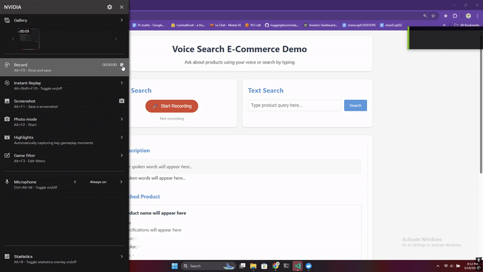

# E-Commerce Voice Search Demo

This project demonstrates a voice search interface for an e-commerce product catalog, using speech-to-text and semantic search technology.

## Demo

### Video Demonstration


<!-- Option 2: Animated GIF from your video -->

*GIF showing basic voice search functionality*

## Installation

### Prerequisites
- Python 3.7 or higher

### Standard Installation

```bash
# Install dependencies (includes NumPy 1.22.0+ required by Whisper)
pip install -r requirements.txt
```

### If you're experiencing dependency issues:

Run the installation helper:

```bash
python install_requirements.py
```

This interactive script will help you resolve common installation issues, including:
- NumPy version conflicts (Whisper requires NumPy 1.22.0+)
- Network/connectivity problems
- Dependency resolution challenges

## Known Issues and Solutions

### NumPy Version Error

If you see this error:
```
ImportError: Numba needs NumPy 1.22 or greater. Got NumPy 1.21.
```

Fix it by:
1. Running `python install_requirements.py`, or
2. Manually updating NumPy: `pip install numpy>=1.22.0`

### Connection issues with pip

If you see errors like:
```
WARNING: Retrying... after connection broken by 'NewConnectionError'
```

Try these solutions:

1. Use the installation helper script: `python install_requirements.py`
2. Check your network/proxy settings
3. Run pip with trusted hosts:
   ```
   pip install -r requirements.txt --trusted-host pypi.org --trusted-host files.pythonhosted.org
   ```
4. If you're behind a proxy, set environment variables:
   ```
   set HTTP_PROXY=http://proxy.example.com:8080
   set HTTPS_PROXY=http://proxy.example.com:8080
   ```

## Running the Application

Once all dependencies are installed:

```bash
python app.py
```

Then open your browser and navigate to: http://127.0.0.1:5000/

## Features

- Voice search for products
- Text-based search
- Speech-to-text transcription
- Semantic matching of queries to products
# voice-search-demo
